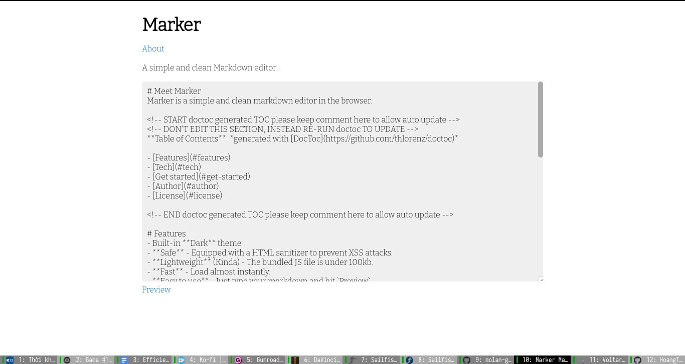

# Meet Marker
Marker is a simple and clean markdown editor in the browser.



<!-- START doctoc generated TOC please keep comment here to allow auto update -->
<!-- DON'T EDIT THIS SECTION, INSTEAD RE-RUN doctoc TO UPDATE -->
**Table of Contents**  *generated with [DocToc](https://github.com/thlorenz/doctoc)*

- [Features](#features)
- [Tech](#tech)
- [Get started](#get-started)
- [Author](#author)
- [License](#license)

<!-- END doctoc generated TOC please keep comment here to allow auto update -->

# Features
- **Safe** - Equipped with a HTML sanitizer to prevent XSS attacks.
- **Lightweight** (Kinda) - The bundled JS file is under 100kb.
- **Fast** - Load almost instantly.
- **Easy to use** - Just type your markdown and hit `Preview`.

# Tech
Marker uses the following to work properly:
- [Mithril](https://mithril.js.org) - Cool hyperscript web framework
- [Marked](https://marked.js.org) - Markdown-to-HTML converter
- [DOMPurify](https://github.com/cure53/DOMPurify) - Sanitize HTML output
- [ESbuild](https://esbuild.github.io) - Bundle the JS file
- [Water.css](https://watercss.kognise.dev/) - Black theme
- [Bitter](https://fonts.google.com/specimen/Bitter) - Newspaper-style font

# Get started
1. Make sure you have [Yarn](https://yarnpkg.com) installed.
2. Clone this repository:
```
git clone https://github.com/HoangTuan110/marker
```
3. Run:
```
yarnpkg install
yarnpkg build
```
To build the project
4. Finally, use a static file server (like [`serve`](https://github.com/vercel/serve)) to serve the HTML file.
5. And you are done!

# Author

An open source project by [@HoangTuan110](https://github.com/HoangTuan110). Made in Vietnam.

# License

MIT
